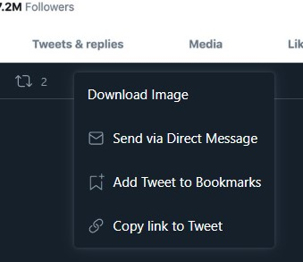
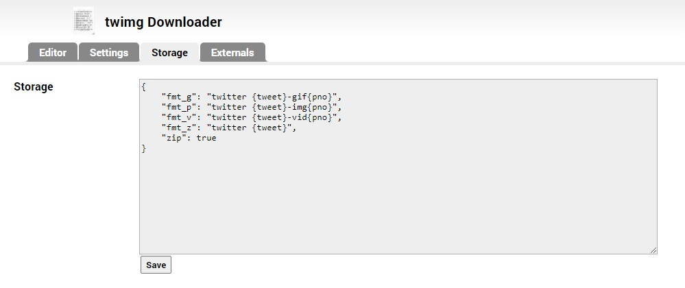

# Twimg Downloader

方便下載推特圖片的腳本

## 安裝腳本

*必須先在瀏覽器安裝腳本管理工具，例如 [Tampermonkey](https://www.tampermonkey.net/)。*

前往 [twimg_downloader.user.js](./twimg_downloader.user.js) 並開啟原始碼（按下程式碼上方的 *Raw* 按鈕），腳本管理工具會自動詢問是否進行安裝；或是可以複製程式後自行在腳本管理工具中新增腳本。

## 使用方式

在有圖片的推特中按下*分享推文*按鈕後，分享選單中會出現 *Download Image*，按下該按鈕即可下載圖片檔案。

## 設定

在 script 編輯頁面的 *Storage* 分頁中可以設定檔案名稱的格式。

|Field| Type |Description                   |
|:---:|:----:|------------------------------|
|~~fmt_g~~|~~string~~|~~Format of name of GIF.~~        |
|fmt_p|string|Format of name of photo.      |
|~~fmt_v~~|~~string~~|~~Format of name of video.~~      |
|fmt_z|string|Format of name of zip file.   |
| zip | bool |Compress files if more then 1.|

### 檔案名稱格式

可使用的佔位符如下：

* `{base}` 原始網址的檔案名
* `{tweet}` 該篇推特的 ID
* `{pno}` 該篇圖片的編號 [1-4]
* `{user}` 該篇推特的發佈者

## 已知問題

* 在快速連點*分享推文*按鈕之後會一直得到錯誤的檔案。
* 在投影片模式（`https://twitter.com/*/status/*/photo/*`）下滑動到其它圖片後可能會得到錯誤的檔案。
* 在投影片模式下分享選單會超出視窗。

## TODO

* 建立設定頁面
* ~~GIF/Video downloader~~
